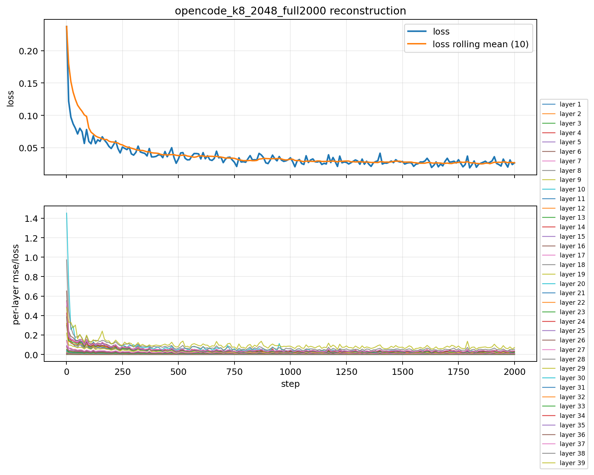
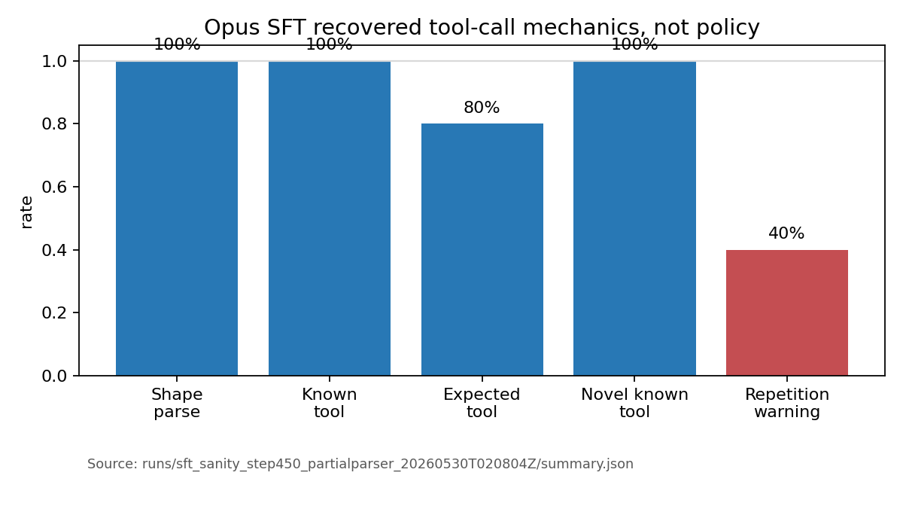
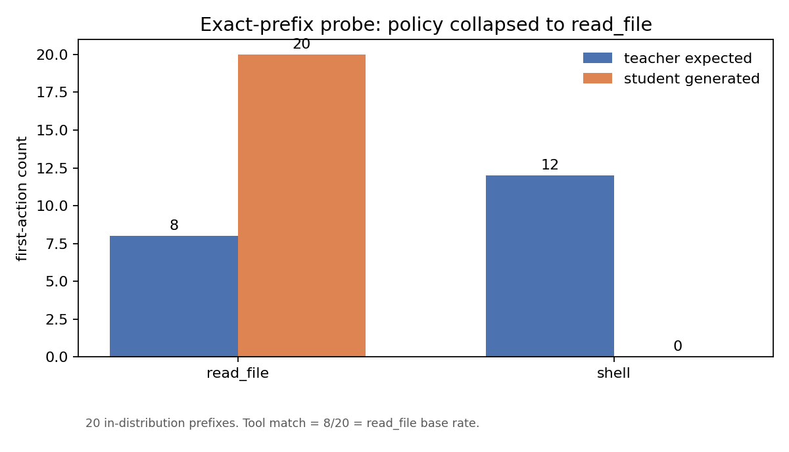
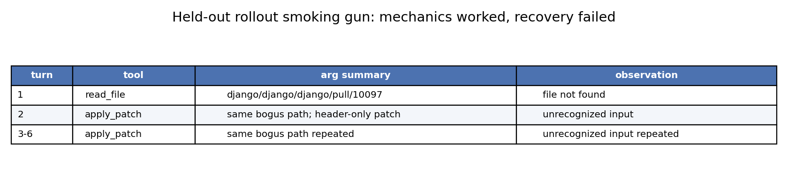
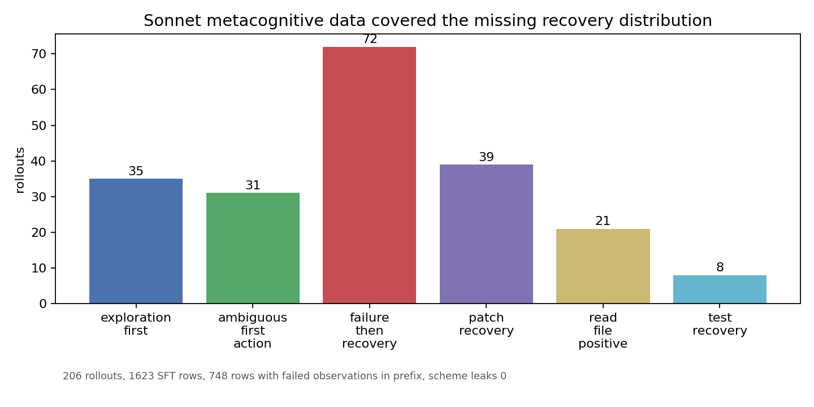
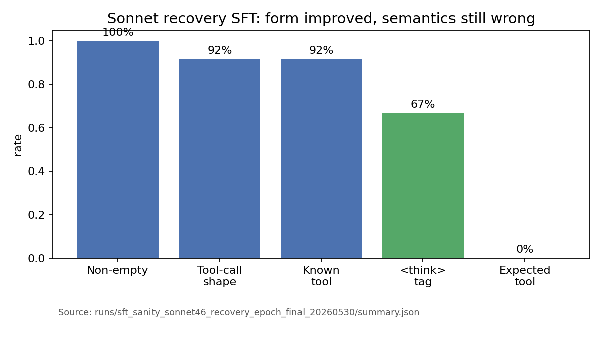
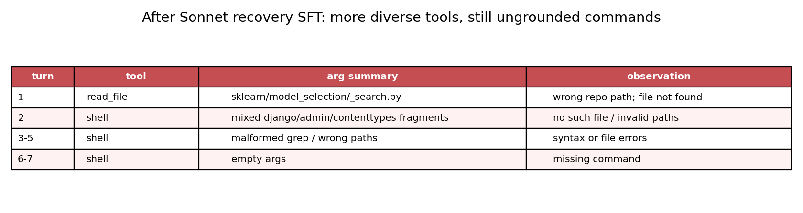
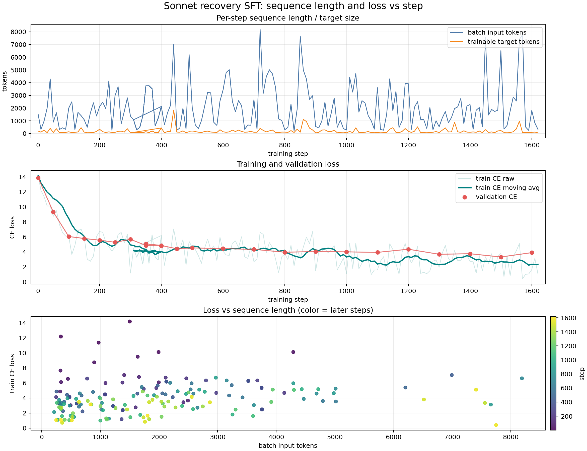
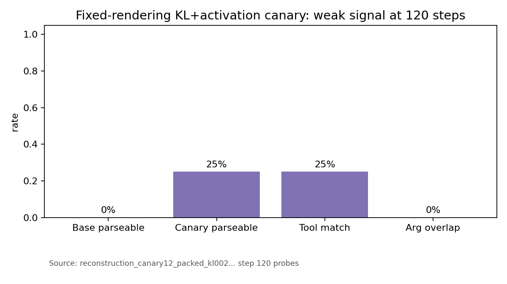

# Sparse-to-Dense Recovery for Laguna XS.2

**Hackathon narrative report.** This is the single-file version of the story:
what we tried, what broke, what the evidence says, and what the next training
run should do.

## Thesis

We tried to recover a simpler dense surrogate from Laguna XS.2's MoE. The
important result is not that the dense model solved coding tasks. It did not.
The useful result is that the pipeline made the failure legible:

```text
activation reconstruction can reduce hidden-state error,
but agentic behavior does not come back unless the reconstruction and SFT
objectives contain direct tool-call, action-choice, and recovery signal.
```

The short version:

```text
MoE -> dense reconstruction -> synthetic SFT -> live harness rollout
   -> exact-prefix policy probe -> metacognitive recovery SFT
   -> reconstruction-data audit -> KL+activation canary
```

## Planned Route

The intended project was a three-stage compression/recovery pipeline:

```text
Stage 1: dense reconstruction
  Replace MoE routed FFNs with dense surrogates and train them with
  teacher-forced activation reconstruction.

Stage 2: supervised recovery of tool behavior
  SFT on gold coding-agent rollouts so the dense model can speak the Laguna
  tool-call protocol and perform basic repository interaction.

Stage 3: online KD / policy recovery from the MoE
  Put the dense model in the harness, let it act, and use the MoE teacher to
  correct/distill the student's own trajectories.
```

The necessary prerequisite for Stage 3 was not "solves SWE-bench." It was
lower-level:

```text
The dense model must be able to tool-call effectively enough to self-drive:
emit parseable calls, choose grounded first actions, read observations, and
recover from failed tool results.
```

We did not get that prerequisite. The rest of this report explains why:

```text
activation MSE gave an undercooked behavioral base;
clean Opus SFT recovered syntax but collapsed policy;
metacognitive Sonnet SFT improved the shape of reasoning but not grounded tool
execution.
```

## 1. Why Dense A MoE?

Laguna XS.2 is efficient at inference because only a subset of experts is
active per token, but MoEs complicate serving: routing, expert dispatch, expert
cache locality, and batching all matter. A dense surrogate would have a simpler
deployment path if enough behavior could be recovered.

We built a Laguna-compatible dense substitute shell and trained it against the
MoE teacher.

## 2. Stage 1: Activation Reconstruction Worked On Loss

The first reconstruction run optimized a teacher-forced activation objective.
It moved quickly:

```text
step 1 loss:     0.2373046875
step 2000 loss:  0.026611328125
best loss:       0.0189208984375 at step 1800
relative drop:   ~88.8%
```



This was necessary, but not sufficient. The pre-SFT dense checkpoint still did
not reliably emit usable Laguna tool calls.

## 3. SFT Data Lineage

The SFT story has three distinct phases.

### Phase 0: Laguna Rollouts Rejected

We first generated roughly 200 Laguna rollouts as possible behavior-cloning
targets. After inspection, these were not the exemplars we wanted to clone:
there was too much tool misuse and weak harness behavior. We did not want to
teach the dense model those failure modes.

### Phase 1: 80 Claude Opus Synthetic Trajectories

We generated 80 clean synthetic trajectories with Claude Opus. This was the
first real SFT run.

The SFT did recover tool-call mechanics. Once the parser was corrected for
Laguna tagged tool calls, the step-450 checkpoint looked healthy on surface
tool use:

```text
rollout-prefix tool-call shape:       5/5
rollout-prefix known tool name:       5/5
rollout-prefix expected tool name:    4/5
novel SWE-bench known tool name:      3/3
repetition/run-on on rollout prefix: ~40%
```



But Opus was too good. The trajectories were clean, one-shot-ish, and
under-covered exploration, failed actions, and recovery. The student learned
the tool-call surface and a marginal first-action prior, not the conditional
policy.

The exact-prefix first-action probe made that visible:

```text
teacher expected:  read_file 8, shell 12
student generated: read_file 20, shell 0
tool_match_rate:   0.4
```

The match rate was exactly the base rate of `read_file`.



## 4. Live Rollout Smoking Gun

The held-out live rollout showed the difference between mechanics and policy.

```text
task: django__django-10097
turns: 6
structured tool calls: 6/6
patch produced: no
stop reason: max_turns
```



The harness and parser worked. The model did not forget the tool-call language.
It failed at grounded first action and observation-conditioned recovery.

## 5. Metacognitive Recovery Data

We then built a 12-family metacognitive prompt pack to force the missing
distribution: exploration, tool misuse, failed observations, retry, patch
repair, and recovery.

The teacher prompt used a quarantined planning block:

```xml
<example>
  <metadata_json>{...}</metadata_json>
  <scheme>teacher-only data-generation planning</scheme>
  <trajectory_json>{child-facing messages only}</trajectory_json>
</example>
```

The child never sees `<scheme>`. The child-facing trajectory keeps only
task-local `<think>` blocks and tool calls.

The most important prompt families were:

```text
P3: PR URL / issue URL trap
  external URLs and issue IDs are not repository paths.

P5: File-not-found recovery
  after file not found, change strategy instead of repeating read_file.

P8: Malformed / no-op patch
  header-only patches are failures; inspect context and emit a real patch.

P11: Correct read_file positives
  prevent overcorrecting to always-shell when the issue gives a clear path.
```

The Sonnet 4.6 generated dataset passed the hard data checks:

```text
rollouts: 206
SFT rows: 1623
first actions: shell 121, read_file 66, apply_patch 19
failure_then_recovery rollouts: 72
patch_recovery rollouts: 39
failed-observation prefix rows: 748
parseable tool-call rows: 1623
child-facing think rows: 1623
scheme leaks: 0
hard failures: []
```



The dataset contained the recovery row shape we wanted:

```text
assistant:
  read_file path=sympy/core/evalf.py

tool:
  Error: file not found: sympy/core/evalf.py

assistant target:
  <think>
  The file was not found at that path. I need to search for the correct
  location of evalf.py in the repository.
  </think>
  <tool_call>shell
  <arg_value>find . -name 'evalf.py' 2>/dev/null</arg_value>
  </tool_call>
```

And patch-recovery examples:

```text
assistant:
  apply_patch with only ---/+++ headers

tool:
  Error: patch is malformed or contains no hunks.

assistant target:
  <think>
  The previous patch had no real edit. I need to find the exact code before I
  can write a correct patch.
  </think>
  <tool_call>shell
  <arg_value>grep -n "has_add_permission" django/contrib/admin/options.py | head -40</arg_value>
  </tool_call>
```

## 6. Sonnet Recovery SFT Improved Form, Not Grounding

The Sonnet recovery SFT sanity probe looked better on surface form:

```text
num_rows: 12
non_empty_rate: 1.0
emits_tool_call_shape_rate: 0.9167
has_known_tool_name_rate: 0.9167
has_think_tag_rate: 0.6667
uses_expected_tool_name_rate: 0.0
```



This is the key qualitative failure:

```text
Expected:
  <think>The previous patch had no real edit ... locate the relevant method.</think>
  <tool_call>shell
  <arg_value>grep -n "has_add_permission" django/contrib/admin/options.py | head -40</arg_value>
  </tool_call>

Generated:
  ... I need to see the exact lines ...
  <tool_call>read_file
  <arg_key>path</arg_key>
  <arg_value>/repo/django/contrib/content.py</arg_value>
  </tool_call>
```

The model learned to produce plausible recovery-flavored text and tool tags,
but still chose wrong tools or ungrounded arguments.

The real validation rollout made this starker:



This moved the diagnosis downward: the issue was no longer only that Opus data
was too clean. Even with recovery-shaped Sonnet data, the dense student could
imitate reasoning style without reliable grounded tool execution. That points
back to the base/reconstruction layer.

The SFT loss did move, but the behavior did not become reliable:

```text
first validation CE: 13.86
best validation CE:   3.34 at step 1500
last validation CE:   3.92
```



## 7. Reconstruction v2: Add Behavior, Then Audit The Data

The next reconstruction objective added a behavior term:

```text
loss = activation MSE + 0.05 * cosine loss + 0.02 * teacher-forced logit KL
```

That was the right direction, but we found a silent rendering confound:
structured `message["tool_calls"]` were present in JSON but were not being
rendered into Laguna tagged text for the reconstruction/KL corpus.

After fixing the formatter, the audit was clean:

```text
structured tool calls:       59,766
rendered tagged tool calls: 124,425
structured tool calls lost:       0

sampled packed sequences:        240
sequences containing <tool_call>: 224
sequences containing <think>:     186
pad tokens:                        0
boundary warnings:                 0
```

The fixed 12-row canary was still weak at 120 steps:

```text
base single-shot parseable: false
exact-prefix parseable:     0.25
tool match:                 0.25
arg overlap:                0.0
```



The canary emitted some shell calls, but did not reliably overfit tool format.
That argues against blindly scaling the same weak signal. Tool-name and
argument tokens likely need more direct weighting or a stronger KD target.

## 8. Diagnosis

```text
Observed failure                         Localized cause
---------------------------------------------------------------------------
No tool calls before SFT                 reconstruction objective not behavioral
Laguna rollouts not cloned               target traces were weak exemplars
Opus SFT tagged calls                     mechanics are recoverable
Opus read_file 20/20 exact-prefix         clean-teacher data caused marginal collapse
Held-out bad path + patch loop            recovery distribution missing
Sonnet plausible thoughts + bad tools     reasoning style learned without grounded execution
v2 KL failed early                       tool-call data rendering bug + weak target weighting
canary only 25% parseable                need targeted token/objective weighting
```

## 9. What We Would Do Next

The next run should not be "more of the same." Each next step targets a measured
failure:

```text
1. Reconstruction v2 properly
   activation MSE + behavior KL on correctly rendered tool-rich data.

2. Action-token weighted objective
   upweight tool name, arg keys, arg values, path strings, commands, and patch bodies.

3. Off-policy KD on teacher trajectories
   distill read_file vs shell choices and argument distributions on real prefixes.

4. Recovery-shaped SFT data
   keep failed action + observation in prefix; corrective action as target.

5. RL only after self-drive
   on-policy is blocked until the student can survive multi-turn feedback.
```

## 10. Contributions

```text
An end-to-end Laguna-compatible dense recovery harness.
A tagged-tool-call parser/eval path for Laguna.
A live SWE-bench-style rollout diagnostic.
A first-action collapse metric.
A metacognitive recovery-data prompt pack.
A reconstruction formatter audit that catches dropped structured tool_calls.
A packed-batch audit that catches padding/boundary issues.
A clear recipe for the next training objective.
```

## Closing

The dense model did not become a coding agent overnight. But the pipeline made
the failure useful:

```text
clean SFT can recover mechanics while collapsing policy;
metacognitive SFT can recover plausible thinking without grounded execution;
real recovery likely needs behavior-aware reconstruction plus targeted
action-token distillation before more policy training.
```
