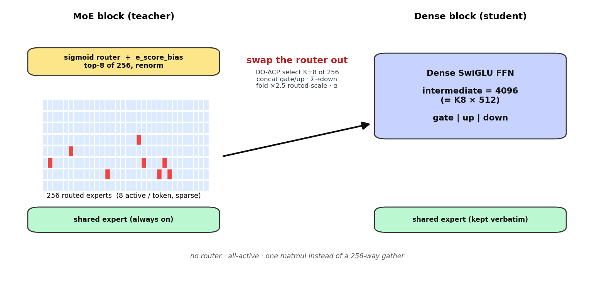
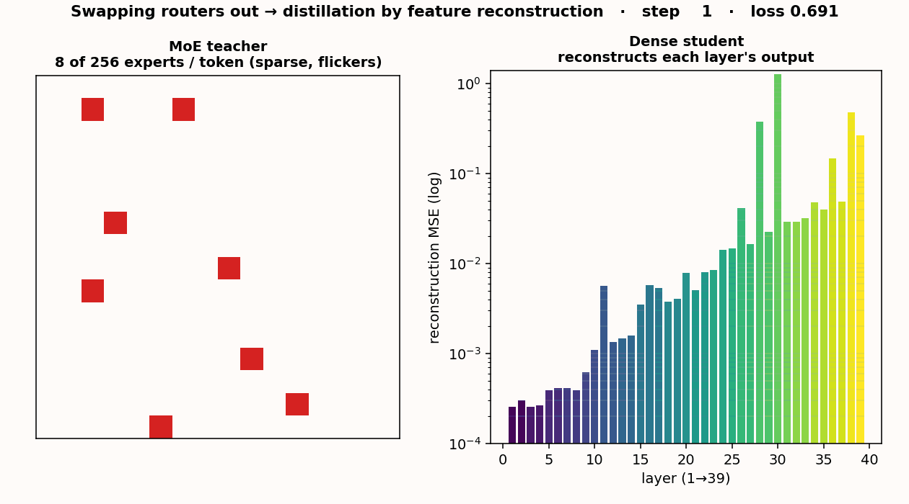
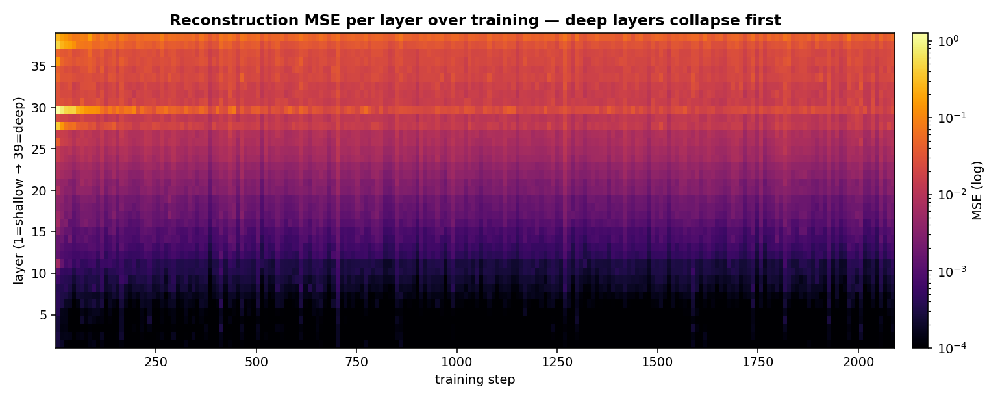
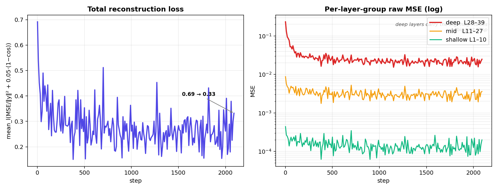

# Swapping the Routers Out — MoE→Dense Distillation Pre-Training

How we turn each sparse **Mixture-of-Experts** block of `poolside/Laguna-XS.2` into a single
**dense SwiGLU FFN**, and recover the lost behaviour by **teacher-forced feature reconstruction**.
Every claim here is backed by a code reference (`file:line`) and the real run metrics in
[`data/reconstruction_results.json`](data/reconstruction_results.json) /
[`runs/reconstruction/`](../../runs/reconstruction/).

> **Teacher:** `poolside/Laguna-XS.2` — 33.4B total / 3.0B active, 256 experts top-8 + 1 shared, 39 sparse layers.
> **Student:** `laguna-xs2-dense-k8` — ~3.0B all-active; each routed block → one dense FFN (K=8 × 512 = 4096 wide).

---

## 1. The swap, at a glance



A token through the **MoE** block hits a **sigmoid router**, picks **8 of 256** experts, and sums their
outputs plus a shared expert. The **dense** block deletes the router entirely: the 8 most useful experts
are selected once (offline) and **concatenated into a single SwiGLU FFN**, so every token runs the *same*
one matmul instead of a 256-way gather.

| | MoE block (teacher) | Dense block (student) |
|---|---|---|
| Router | sigmoid + `e_score_correction_bias`, top-8 renorm | **none (removed)** |
| FFN | 256 routed experts (8 active/token) + shared | **1 dense SwiGLU (4096) + shared (kept)** |
| Routed scaling | `×2.5` applied at runtime | **folded into the down-proj** |
| Params / token | ~3.0B active (of 33.4B) | ~3.0B (of ~3.0B — all active) |
| Per-token FFN cost | data-dependent expert gather | one fixed matmul |

---

## 2. What the swap is, in code

**Select which 8 experts** — DO-ACP, the KRAFTON winner (D-optimal greedy on the importance-weighted
expert-output Gram), `src/densify/densify_layer.py:121`:

```python
def select_do_acp(routing, experts, k):
    I = acp_scores(routing, experts).double()          # importance = CP · ‖f_e‖
    K = (sqrtI[:, None] * sqrtI[None, :]) * experts.gram   # importance-weighted kernel  :130
    for _ in range(k):                                  # greedy: add the expert that most
        ... sign, logdet = torch.linalg.slogdet(sub)    # increases log det(K_S)         :145
        selected.append(best_idx)                       # → maximises importance AND diversity
```

**Concatenate them into one dense FFN**, folding the `×2.5` routed scale and per-expert `α` into the
down-projection — `src/densify/densify_layer.py:166`:

```python
for e in idx:                          # the K selected experts
    gate_blocks.append(gate_up[e][:I]) # stack gate rows
    up_blocks.append(gate_up[e][I:])   # stack up rows
    down_blocks.append(down[e] * (rs * alpha[e]))   # ×2.5 · α folded in   :194
gate_w = torch.cat(gate_blocks, 0)     # [k·I, H]
up_w   = torch.cat(up_blocks,   0)     # [k·I, H]
down_w = torch.cat(down_blocks, 1)     # [H, k·I]    :196-198
```

**The behavioural difference** — the dense forward drops routing entirely; `dense_forward` vs the routed
block, `src/densify/densify_layer.py:202`:

```python
# DENSE (student): one SwiGLU + shared, no gather
g = act(F.linear(x, dense["gate"]));  u = F.linear(x, dense["up"])
routed = F.linear(g * u, dense["down"])
return routed + shared_experts(x)                    # :209-211
# MoE (teacher): sigmoid-route → top-8 gather → weighted sum + shared  (LagunaSparseMoeBlock)
```

---

## 3. The distillation objective

We don't retrain the dense FFN end-to-end; we make each layer's dense FFN **reproduce the teacher MoE
block's output on the teacher's own input** (teacher-forced, so errors can't compound across the 40-layer
stack). All 39 layers are reconstructed **in parallel** from a single teacher forward.

**Capture each MoE block's `(xₗ, yₗ)`** via hooks — `src/densify/reconstruction.py:56`:

```python
inputs[layer_id]  = _first_tensor(module_inputs).detach()   # xₗ  :69
outputs[layer_id] = _first_tensor(module_output).detach()   # yₗ  :70  (teacher MoE output = target)
```

**Per-layer loss** — masked MSE (optionally energy-normalised) + a small cosine term —
`src/densify/reconstruction.py:120`:

```python
pred = student_mlp(x)                                  # dense FFN on the TEACHER's xₗ   :124
mse_per_token = (pred - target).pow(2).mean(dim=-1)
mse, n = _masked_mean(mse_per_token, attention_mask)   # pad tokens excluded            :128
loss = mse
if normalize:
    energy, _ = _masked_mean(target.pow(2).mean(-1), attention_mask)
    loss = mse / (energy + 1e-6)                        # deep layers can't dominate     :133
if cosine_weight:
    cos = 1 - F.cosine_similarity(pred, target, dim=-1)
    loss = loss + cosine_weight * cos                   # 0.05 · (1-cos)                 :138
# total = mean over all 39 layers                                                       :146
```

---

## 4. Training tricks (each with its source)

| Trick | Why | Where |
|---|---|---|
| **DO-ACP warm-start** of the dense FFN (not random init) | start near the teacher → recover in a tiny budget | `densify_layer.py:121`, `scripts/warm_start_dense.py` |
| **Freeze everything except `*.routed_dense.*`** | only the new FFN learns; attention/embeds/norms/shared/lm_head stay = teacher | `reconstruction.py:46` |
| **Teacher-forced, all-39-layer-parallel** targets | each FFN learns `xₗ→yₗ` independently → **no error compounding**; one teacher fwd feeds all layers | `reconstruction.py:100,124` |
| **Attention-masked loss** | pad tokens never pollute the stats | `reconstruction.py:90` |
| **Per-layer energy normalisation** (`÷ mean‖y‖²`) | deep layers carry large magnitudes; without this they swamp the loss | `reconstruction.py:130-133` |
| **Cosine auxiliary** (0.05·(1−cos)) | match *direction*, not just magnitude | `reconstruction.py:134-138` |
| **Adafactor @ 2e-4** (not AdamW) | full-39-layer optimizer state fits 80GB; AdamW overflows | `train_dense_reconstruction.py:168` |
| **Weighted multi-domain interleave** (`--datasets name:weight`) | kernel-anchored mix exercises the kernel-specialist experts (see the activation reports) | `train_dense_reconstruction.py` (`mixed_rows`) |

---

## 5. Distillation, visualised

The dense student learns to reconstruct every layer at once — the teacher routes 8/256 per token (sparse,
flickering), the student answers with one steady FFN whose per-layer error collapses:



Deep layers start with the largest error (largest activation magnitudes) and fall the furthest:





---

## 6. Results (real runs, numerical)

Full numbers in [`data/reconstruction_results.json`](data/reconstruction_results.json); raw per-step logs in
[`runs/reconstruction/*/metrics.jsonl`](../../runs/reconstruction/).

**V1 — OpenCodeInstruct, all 39 layers, 2090 steps, 35.6 min, 1×H100:**

| Quantity | start → end |
|---|---|
| total reconstruction loss | **0.691 → 0.332** |
| deep MSE (L28–39) | **0.232 → 0.025** |
| mid MSE (L11–27) | 0.0087 → 0.0036 |
| shallow MSE (L1–10) | 0.00044 → 0.00020 |
| mean cosine-loss | 0.435 → 0.245 |
| L30 MSE (worst layer) | **1.266 → 0.026** |
| L39 MSE | 0.266 → 0.054 |

**V2 — kernel-mixture (KernelBook + CUDA + OpenCode), 2000 steps, 35.3 min:** loss **0.672 → 0.163**,
deep MSE **0.204 → 0.018** — i.e. the kernel-anchored mix reconstructs **~2× lower final loss** than V1,
consistent with the activation finding that kernel inputs route through a narrower, easier-to-fit expert
set (see [`expert-activation-by-dataset.md`](expert-activation-by-dataset.md)).

---

## 7. Where these results were shown

- **Gists:** [full report](https://gist.github.com/Tyronita/f2464ec6d938ae165c0466b5cc689f01) ·
  [living reference](https://gist.github.com/Tyronita/590dbaf1aa435b506f00547d57300e07) ·
  [smoke test](https://gist.github.com/Tyronita/5e53fb8b29da9bb5edd9a8152f280381) ·
  [run-0 + recipe comparison](https://gist.github.com/Tyronita/08f51e7999f0b0efdc2fb9ac10c78892) ·
  [kernel-mix smoke](https://gist.github.com/Tyronita/a57542dd2b911fe8888a5a5d9a78de32) ·
  [paper notes/compute](https://gist.github.com/Tyronita/ba18a3eab228b799204b9757ad8058ca) ·
  [plan for Jessica](https://gist.github.com/Tyronita/c4b11c049832918767b7a060aa2b8125)
- **Repo runs:** `runs/reconstruction/{opencode_v1_5k,kernelmix_v2_2k}/` (metrics + curve PNGs).
- **HF:** `EvanOLeary/laguna-xs2-dense-k8-recon` (checkpoints + model card).

## 8. Method papers & what's next

Recipe = **RADLADS** (arXiv:2505.03005) step-1 feature alignment + **KRAFTON MoE→Dense**
(arXiv:2605.28207) DO-ACP scoring. This is *representation alignment only* — the next stage is
**logit-KD** (the actual quality-recovery step in both papers), then SFT/RFT. See
[`MODEL_CHANGES.md`](../MODEL_CHANGES.md) and [`expert-activation-by-dataset.md`](expert-activation-by-dataset.md).
