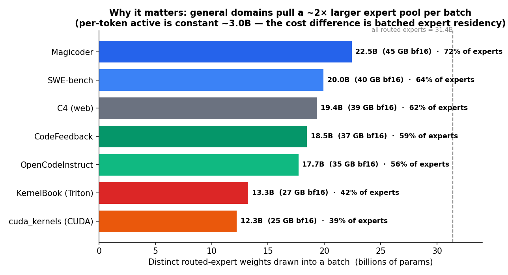
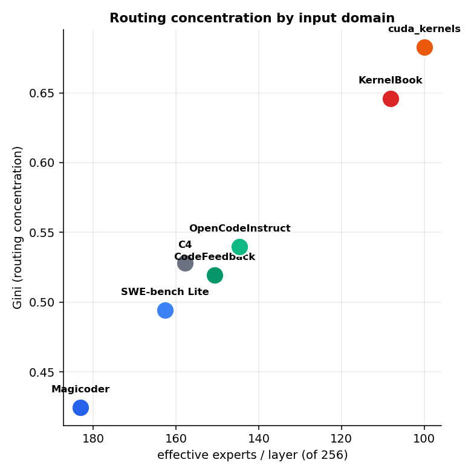
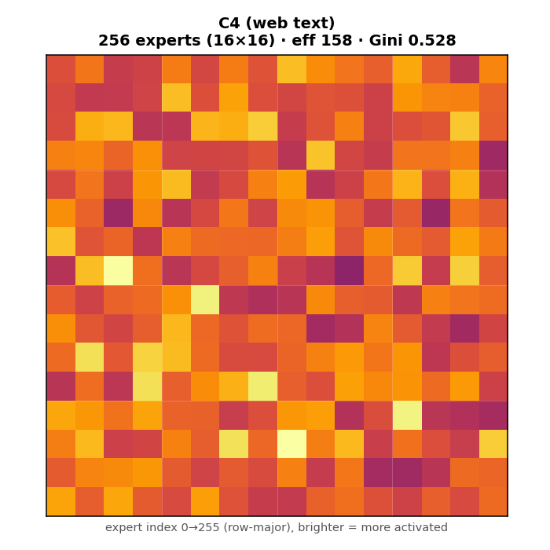
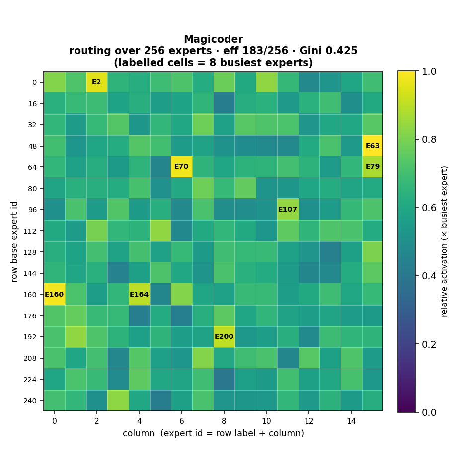
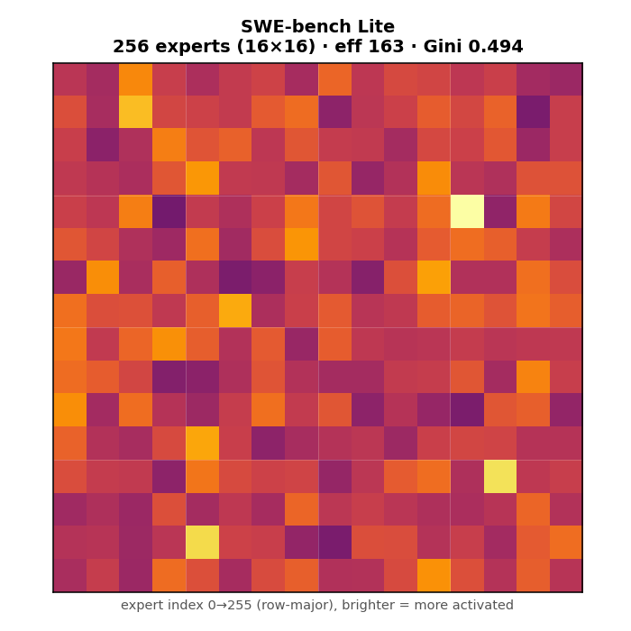
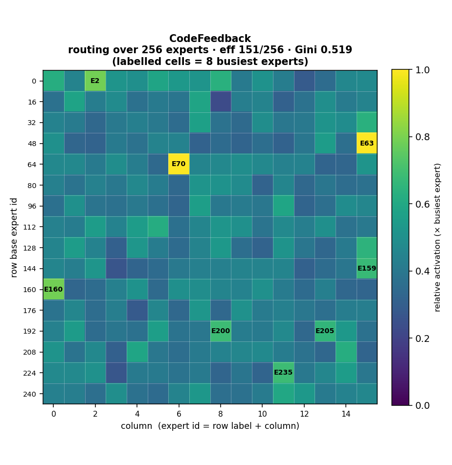
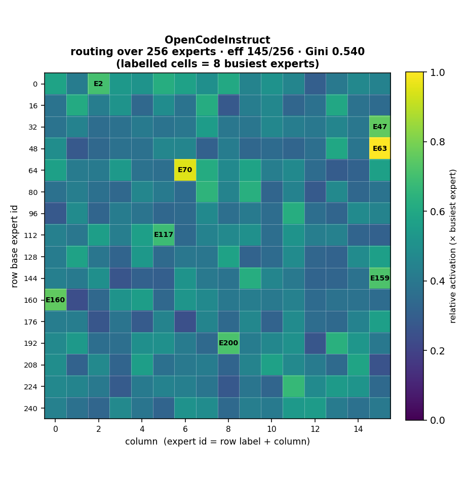
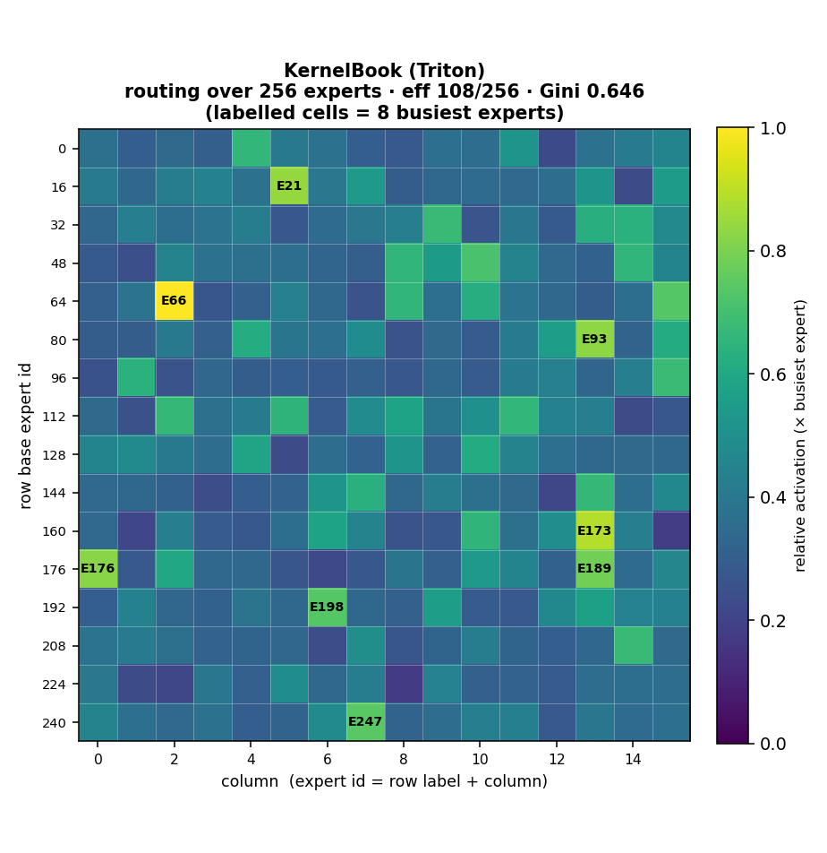
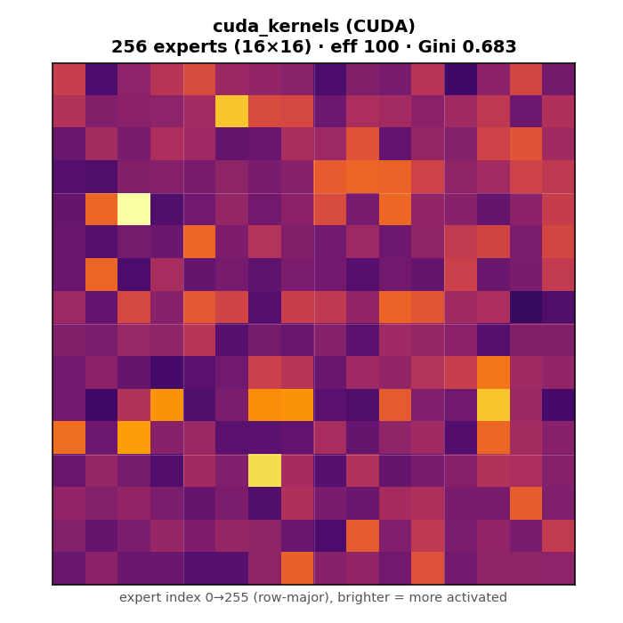
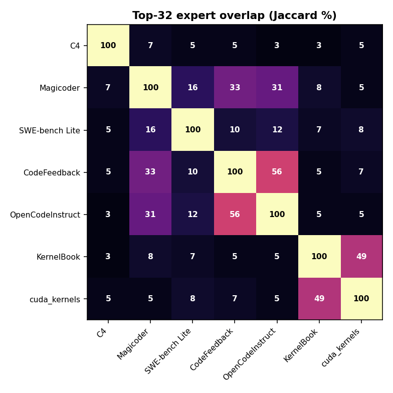

# Laguna-XS.2 — Expert Activation, Dataset by Dataset
### what each query domain costs the router, and why it matters for serving

## The experiment

`poolside/Laguna-XS.2` is a **generalist coding agent**: a Mixture-of-Experts model with
**33.4B total params** but only **~3.0B active per token** — every token is routed to its
**top-8 of 256 experts** in each of **39 sparse layers**. We took each dataset in the
densification training mix (plus **SWE-bench**), fed its **question/prompt** through the
*frozen* teacher one item at a time, hooked every `LagunaTopKRouter`, and recorded **which
experts actually fire**.

The metric to watch is **effective experts/layer** — the entropy-based count of how many
distinct experts a domain really spreads its tokens across (of 256). Per *single token* the
cost is fixed (8 experts ≈ 3.0B active params, no matter the domain). But a **batch** of
tokens touches the **union** of their experts — so the *distinct expert pool* a domain draws
in is what must stay resident / be streamed at serve time.

**The "why".** Because this is a generalist agent, **more general inputs draw in larger pools
of experts.** Web text and natural-language instructions spread across ~158–183 experts/layer;
specialised kernel code concentrates onto ~100–108. That means a general-domain batch must
materialise **~2× the expert weights** of a kernel batch (22.5B vs 12.3B) for the *same*
per-token compute — i.e. **worse runtime efficiency in batched / served cases** (more
weight movement, lower per-expert token counts, lower arithmetic intensity). This is exactly
the overhead a MoE→dense collapse removes, and it's why we profile the pool per domain before
choosing the dense width and the data mix.



Each dataset below shows its **256-expert activation grid (16×16)** — labelled cells are the
8 busiest experts; `expert id = row-base label + column`.



| Dataset | Kind | Eff. experts | Gini | Expert pool / batch |
|---|---|--:|--:|--:|
| `magicoder` | NL instruction | 183 | 0.425 | 22.5B (72%) |
| `swebench_lite` | NL problem | 163 | 0.494 | 20.0B (64%) |
| *c4 (baseline)* | *web text* | *158* | *0.528* | *19.4B (62%)* |
| `codefeedback` | NL query | 151 | 0.519 | 18.5B (59%) |
| `opencodeinstruct` | NL→Python | 145 | 0.540 | 17.7B (56%) |
| `kernelbook` | Triton src | 108 | 0.646 | 13.3B (42%) |
| `cuda_kernels` | CUDA src | 100 | 0.683 | 12.3B (39%) |

*Per-token active params are ~3.0B for every row; the pool column is the distinct routed-expert weight a batch of that domain pulls in (of 31.4B total routed).*

---

## 1. `allenai/c4`
> General web text — the broad baseline. ~62% of all experts get drawn into a batch.



**web text (baseline)** · `400 questions / 161,932 tokens`  
**eff 158/256** · Gini 0.528 · per-token active **~3.0B** · batched expert pool **19.4B** (62% of routed weights)  
*(baseline — see C4 gist)*

---

## 2. `ise-uiuc/Magicoder-Evol-Instruct-110K`
> Plain-English coding instructions — the **widest** expert pool of all (72%), so the **worst** batched expert residency.



**NL instruction** · `300 questions / 47,874 tokens`  
**eff 183/256** · Gini 0.425 · per-token active **~3.0B** · batched expert pool **22.5B** (72% of routed weights)  
top experts: E63, E160, E70, E2, E200, E164, E79, E107

Sample fed through Laguna:

````text
Please amend the subsequent Python script so that it includes a 'while' loop rather than the existing 'for' loop, which iterates through the items of an integer list.

The script currently has a bug where it attempts to print an object that is outside the bounds of the list. Fix this error and modify the script to use 'while' instead of 'for' loop. Ensure your script correctly handles empty lists. 

```python
  # Establish an integer list
  arr = [1, 2, 3, 4]

  # Determine the length of the lis
````

---

## 3. `princeton-nlp/SWE-bench_Lite`
> GitHub-issue prose — routes almost exactly like web text; a wide 64% pool.



**NL problem statement** · `300 questions / 115,888 tokens`  
**eff 163/256** · Gini 0.494 · per-token active **~3.0B** · batched expert pool **20.0B** (64% of routed weights)  
top experts: E76, E205, E228, E18, E117, E180, E107, E52

Sample fed through Laguna:

````text
Modeling's `separability_matrix` does not compute separability correctly for nested CompoundModels
Consider the following model:

```python
from astropy.modeling import models as m
from astropy.modeling.separable import separability_matrix

cm = m.Linear1D(10) & m.Linear1D(5)
```

It's separability matrix as you might expect is a diagonal:

```python
>>> separability_matrix(cm)
array([[ True, False],
       [False,  True]])
```

If I make the model more complex:
```python
>>>
````

---

## 4. `m-a-p/CodeFeedback-Filtered-Instruction`
> Code Q&A — tightening as concrete code appears (59% pool).



**NL query** · `300 questions / 50,164 tokens`  
**eff 151/256** · Gini 0.519 · per-token active **~3.0B** · batched expert pool **18.5B** (59% of routed weights)  
top experts: E70, E63, E160, E2, E200, E235, E159, E205

Sample fed through Laguna:

````text
Create a nested loop to print every combination of numbers between 0-9, excluding any combination that contains the number 5. Additionally, exclude any combination that contains a repeating digit. Implement the solution without using any built-in functions or libraries to check for repeating digits.
````

---

## 5. `nvidia/OpenCodeInstruct`
> Python tasks — Python tokens start concentrating the router (56% pool).



**NL → Python** · `300 questions / 66,590 tokens`  
**eff 145/256** · Gini 0.540 · per-token active **~3.0B** · batched expert pool **17.7B** (56% of routed weights)  
top experts: E63, E70, E160, E47, E159, E200, E2, E117

Sample fed through Laguna:

````text
You are given a list of `n` tasks, each represented as a tuple `(start, end)`, indicating the start and end times of the task. The tasks are sorted by their start times. Your goal is to determine the maximum number of non-overlapping tasks that can be selected. Two tasks are considered non-overlapping if the start time of one task is greater than or equal to the end time of the other.

**Input:**
- An integer `n` representing the number of tasks.
- A list of `n` tuples, where each tuple `(start,
````

---

## 6. `GPUMODE/KernelBook`
> PyTorch/Triton source — routing **collapses** to a 42% pool; batch-friendly.



**Triton / PyTorch source** · `300 questions / 108,815 tokens`  
**eff 108/256** · Gini 0.646 · per-token active **~3.0B** · batched expert pool **13.3B** (42% of routed weights)  
top experts: E66, E173, E21, E93, E176, E189, E247, E198

Sample fed through Laguna:

````python
import torch
import torch.nn as nn


class SumAggregator(nn.Module):

    def __init__(self):
        super(SumAggregator, self).__init__()

    def forward(self, neighbor):
        return torch.sum(neighbor, dim=1)


def get_inputs():
    return [torch.rand([4, 4, 4, 4])]


def get_init_inputs():
    return [[], {}]
````

---

## 7. `andrew-wang/cuda_kernels`
> Raw CUDA — the **tightest** 39% pool, the **best** batched efficiency.



**CUDA C++ source** · `137 questions / 75,709 tokens`  
**eff 100/256** · Gini 0.683 · per-token active **~3.0B** · batched expert pool **12.3B** (39% of routed weights)  
top experts: E66, E198, E173, E21, E178, E163, E167, E166

Sample fed through Laguna:

````python
import torch
import torch.nn as nn
from torch.utils.cpp_extension import load_inline

# Define the custom CUDA kernel for element-wise multiplication and bias addition
elementwise_multiply_add_source = """
#include <torch/extension.h>
#include <cuda_runtime.h>

__global__ void elementwise_multiply_add_kernel(const float* x, const float* weight, const float* bias, float* out, int n_channels) {
    int c = blockIdx.x;
    int n = blockIdx.y;
    if (c < n_channels && n < warpSize) {
        int id
````

---

## 8. Cross-dataset expert overlap

> Three near-disjoint neighborhoods: web text, code-instruct (OpenCode↔CodeFeedback 56%),
> and kernels (KernelBook↔CUDA 49%). Cross-cluster overlap is only 3–8% — the pools aren't
> just different *sizes*, they're different *experts*.



---

## Implications

- **Serving cost is domain-dependent even though per-token FLOPs aren't.** A generalist coding
  agent answering general/NL queries pulls ~72% of expert weights into a batch vs ~39% for
  kernels — ~2× the expert residency for identical per-token compute. Batched throughput suffers
  most exactly where the agent is most "general".
- **This is the case for densification.** Collapsing the routed experts into one dense SwiGLU
  FFN gives a **constant ~3.3B all-active** footprint with **no routing and no expert-pool
  blow-up** — predictable batched efficiency across every domain.
- **It also sizes the dense width.** General use needs ~158–183 effective experts/layer, so the
  dense surrogate (K×512) must be wide enough to reconstruct that broad pool — `K=8` is a floor;
  the K-sweep targets the general-domain pool, not the kernel one.
- **And it sets the data mix.** Kernel-specialist experts (E66, E198, E21, E173 …) are near-silent
  on general text; if the densification mix isn't kernel-anchored they're never reconstructed —
  hence the weighted `--datasets` interleave.

---

*Method: `analyze_datasets_expert.py` — one forward pass per question, top-8 membership
accumulated per layer (`[39,256]`). Pool = effective-experts/layer × per-expert params (3.146M,
SwiGLU moe_inter 512) × 39 layers. Per-dataset stats in `dataset_diag/`. Code-only datasets use
their source as the input.*
